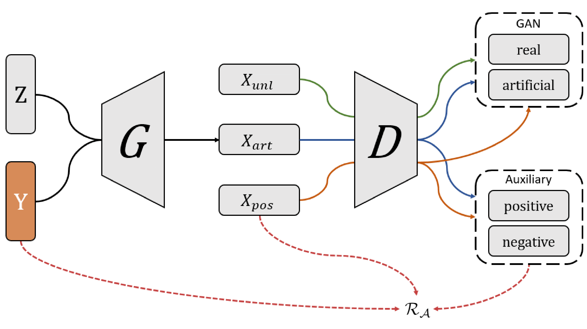
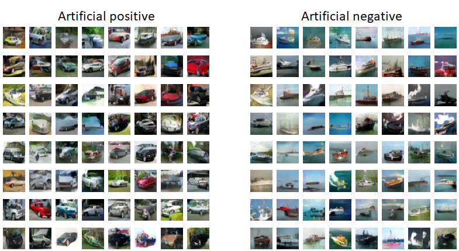
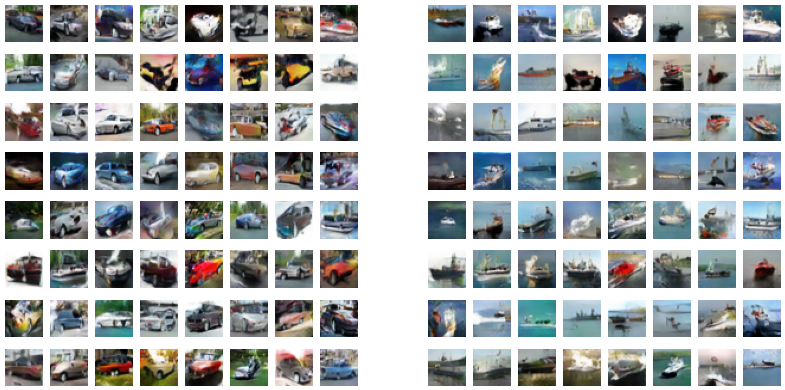
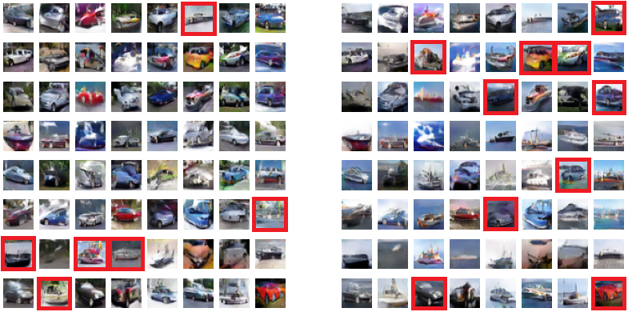

CGenPU
========

|License Badge|

The conditional Generative PU framework (CGenPU) is a novel approach to learning the positive and negative data distributions from the positive and unlabeled dataset. The framework is based on the Auxiliary Classifier GAN (AC-GAN) [1]_, generating class-conditional examples. CGenPU reuses AC-GAN's framework and training scheme. However, to discriminate positive and negative examples, a novel auxiliary objective function is implemented. The experimental evaluation has shown that CGenPU requires fewer labeled training examples than existing methods. On top of that, CGenPU is the first single-stage generative framework for positive and unlabeled learning. For more details, please, refer to the article Papič et al. [2]_.

   The scheme of the CGenPU learning framework, with a class-conditional generator and an auxiliary classifier (seen in dotted boxes on the right-hand side). Solid arrows indicate the flow of data within the framework, while the red dashed lines refer to the flow of labels. The framework's output is i) a generator capable of generating artificial positive and negative data, and ii) a binary classifier capable of classifying in positive or negative class.

Results CIFAR-10
--------

Generated artificial positive (car) and negative (ship) examples using the CIFAR-10 dataset [3]_. During the experimental evaluation, we varied the number of labeled examples. Images in both left and right columns at matching positions have the same latent vectors but different input labels. Red boxes indicate out-of-distribution examples.

   50 labeled positive examples.

   25 labeled positive examples.

   10 labeled positive examples.

Installation
--------

The project requires Python 3.8 or higher in order to run.

.. code::

    matplotlib==3.3.1
    numpy==1.19.5
    tensorflow-gpu==2.4.0
    tqdm==4.58.0
    wandb==0.10.21

The CGenPU framework can be installed from the source.

.. code::

    python setup.py install

Usage
--------

Getting started with CGenPU is very simple. Follow the template below.

.. code:: python

    from pu.CGenPU import CGenPU

    # Load data
    xp, xu = <put your code>

    # Parameters
    input_dim = <put your code>
    latent_dim = <put your code>

    # Load models
    D = <put your code>
    A = <put your code>
    G = <put your code>

    # Initialize framework
    g = CGenPU(input_dim, latent_dim, (D, A, G))
    # Start training process
    g.fit(xp, xu, epochs=<put your code>)

Benchmark example on synthetic moon dataset is available `HERE <./examples/basic.py>`_.

Citation
--------

If you use CGenPU for your work, we would appreciate it if you would cite the paper.

.. code::

    @article {Papič...}

References
--------

.. [1] Augustus Odena, C. Olah, and J. Shlens, "Conditional image synthesis with auxiliary classifier gans," in ICML, 2017, pp. 2642–2651.
.. [2] Aleš Papič, I. Kononenko, and Z. Bosnić, "Conditional Generative Positive and Unlabeled Learning."
.. [3] Alex Krizhevsky, "Learning multiple layers of features from tiny images," University of Toronto, Tech. Rep., 2009.

.. |License Badge| image:: https://img.shields.io/badge/License-BSD%203--Clause-blue.svg
   :target: https://opensource.org/licenses/BSD-3-Clause